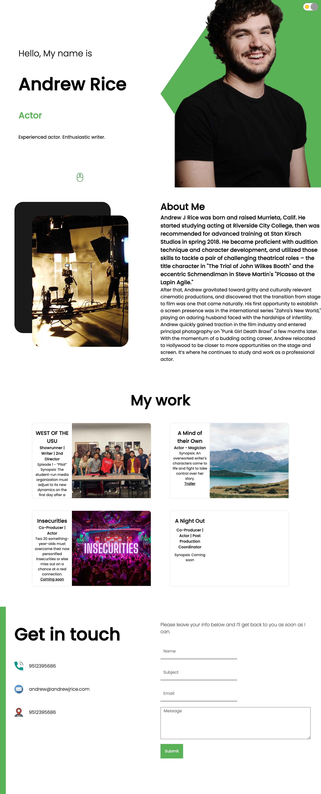
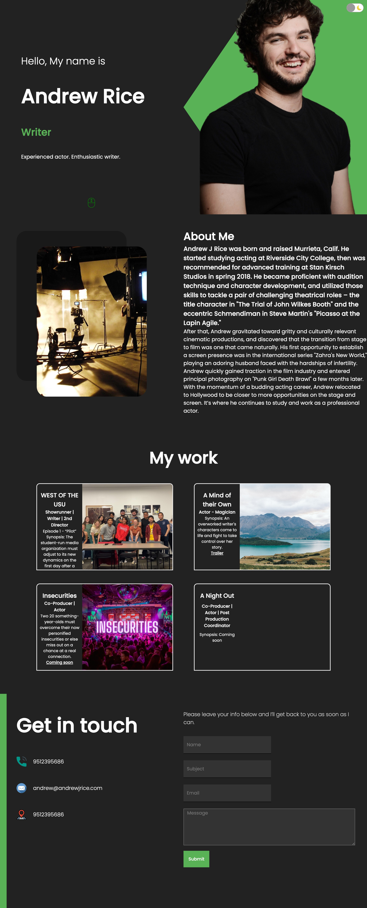

# Portfolio for Andrew J Rice

#### By Ebru Rice

#### This is a portfolio page for Andrew J Rice.

## Technologies Used

* HTML
* CSS
* JavaScript
* React
* NPM

## Description
A portfolio that is designed for Actor/Writer Andrew J Rice to showcase his experience, career and ambitions. The portfolio has 4 different components; intro page, about me page, my work page and a contact page. You can send emails through the contact page. 

## GitHub Pages

[Click here](https://ebruri.github.io/ajr-portfolio) to check it out in GitHub pages.

## Setup/Installation Requirements

* Open Terminal
* Change the current working directory to the location where you want the cloned directory.
* Type ``git clone https://github.com/ebruri/ajr-portfolio``
* Press enter to create your local clone.
* Install dependancies for the application by using the command $ ``npm install``
* Run the application by using the command ``npm run start``

## Research & Planning Log

Saturday August 6th
* 9:00 Add SVG code for scrolling
* 12:00 Work on the work list
* 17:00 Complete work list
* 20:00 Add the contact page
* 21:00 Last touches

Friday August 5th
* 13:00 Add about me text and image  

Wednesday August 3rd
* 16:00 Add image to the introduction page and polish it up
* 21:00 Change the image and work on the about me component

Tuesday August 2nd
* 19:00 Watch some youtube videos about CSS
* 21:00 Start a new react app
* 22:00 Add introduction component - done for the day

Sunday July 24th
* 20:00 Create react app
* 21:00 Add components

Tuesday July 19th
* 19:00 [React Crash Course](https://www.youtube.com/watch?v=Dorf8i6lCuk&ab_channel=Academind)

Sunday, July 10th
* 10:00 [React Crash Course](https://www.youtube.com/watch?v=Dorf8i6lCuk&ab_channel=Academind)
* 14:00 [Drag and Drop React Tutorial](https://www.youtube.com/watch?v=4bzJrEETW4w)

Saturday, July 9th, 2022
* 16:00 [React Crash Course](https://www.youtube.com/watch?v=Dorf8i6lCuk&ab_channel=Academind)

Monday, June 27th, 2022
* 13:00 [React Crash Course](https://www.youtube.com/watch?v=Dorf8i6lCuk&ab_channel=Academind)

Tuesday, June 21st, 2022
* 20:00 Firebase tutorial
* 21:30 Update the proposal 

Monday, June 20th, 2022
* 16:00 Research about ADHD tools 
* 20:00 Planning 

## Known Bugs

* No known bugs at this time

## License

You are welcome to contribute to the code. You can also contact me with any questions.

Copyright (c) 2021 Ebru Rice

Licensed under the [MIT license](license.txt)